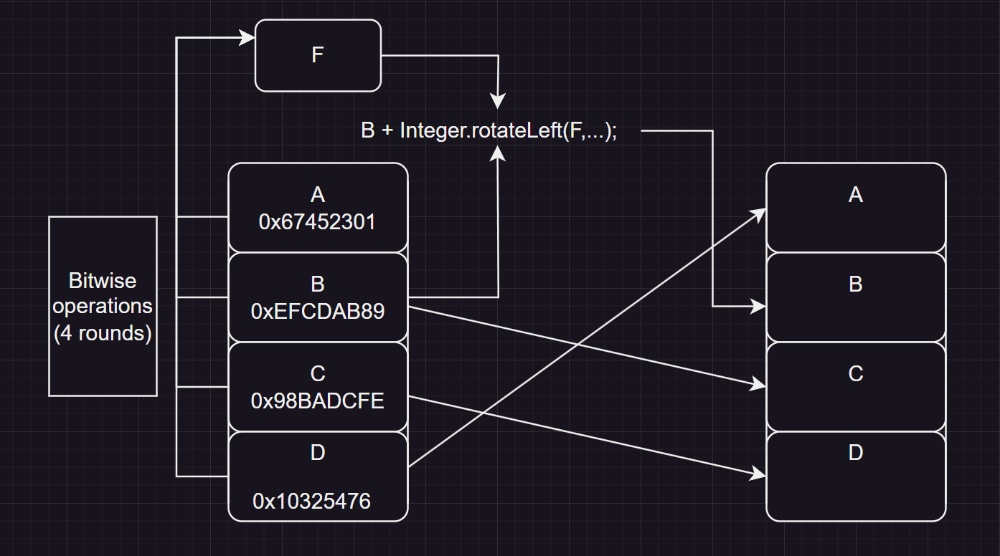

# Message Digest 5 (MD5)
---

## What is MD5?

MD5 or message digest is a widely used hash function that produces a 128-bit hash value. MD5 was designed by Ronald Rivest in 1991 to replace an earlier hash function MD4, and was specified in 1992 as RFC 1321.  

>Message digests, also known as hash functions, are one-way functions; they accept a message of any size as input and produce as output a fixed-length hash.

--- 

## How Does MD5 Work?

The MD5 algorithm will take in an input, then divide it into 512 bit chunks of data. These chunks are then broken down into 16 words of 32 bit (4 bytes). Finally, the 128 bit output is obtained. Of course, the procedure above is just a high level overview of the whole process. We will dive in deeper on how MD5 operates.

---

## Code Preview

```Java

public class MD5 {

    // Initializing hard coded values to be used
    private static final int[] INITIAL_VALUES = {
        0x67452301, // A
        0xEFCDAB89, // B
        0x98BADCFE, // C
        0x10325476  // D
    };
    private static final int[] K = new int[64];
    static{
        for (int i = 0; i < K.length; i++) {
            K[i] = (int) (long) ((1L << 32) * Math.abs(Math.sin(i + 1)));
            
        }
    }
    private static final int[] SHIFT_AMOUNTS = {
        7, 12, 17, 22, 5,  9, 14, 20,
        4, 11, 16, 23, 6, 10, 15, 21
    };

    // MD5 function

    public static String getMD5(String input){
        byte[] message = input.getBytes();
        byte[] paddedMessage = padMessage(message);
        int [] buffer = Arrays.copyOf(INITIAL_VALUES, 4);
        for (int i = 0; i < paddedMessage.length / 64; i++) {
            int [] M = new int[16]; // divide 64 bytes (512 bits) into 16 parts with 4 bytes each (32 bits)
            ByteBuffer.wrap(paddedMessage,i * 64, 64).order(ByteOrder.LITTLE_ENDIAN).asIntBuffer().get(M);
            processChunk(M, buffer);
        }
        ByteBuffer resultBuffer = ByteBuffer.allocate(16).order(ByteOrder.LITTLE_ENDIAN);
        // Add new buffer states
        resultBuffer.putInt(buffer[0]);
        resultBuffer.putInt(buffer[1]);
        resultBuffer.putInt(buffer[2]);
        resultBuffer.putInt(buffer[3]);

        byte[] byteArray = resultBuffer.array();
        StringBuilder hexCode = new StringBuilder();

        for(byte b : byteArray){
            String hex = Integer.toHexString(0xff & b);
            if(hex.length() == 1) hexCode.append('0');
            hexCode.append(hex);
            
        }
        return hexCode.toString();


    }

    private static byte[] padMessage(byte[] message){
        int length = message.length;
        int paddingLength = (56 - (length + 1) % 64 + 64) % 64;
        ByteBuffer byteBuffer = ByteBuffer.allocate(length + 1 + paddingLength + 8).order(ByteOrder.LITTLE_ENDIAN);
        byteBuffer.put(message);
        byteBuffer.put((byte) 0x80); // Insert 1 bit
        byteBuffer.position(byteBuffer.capacity() - 8); // Position the cursor to the last 8 bytes to insert the original length in 64 bits (8 bytes)
        byteBuffer.putLong((long) length * 8); // Put the original length of message in 64 bits
        return byteBuffer.array();
    }

    private static void processChunk(int[] M, int[] buffer){
        int A =  buffer[0], B = buffer[1], C = buffer[2], D = buffer[3]; //Initial state of the hash
        int F,g;
        for (int i = 0; i < 64; i++) {
            if(i < 16){
                F = (B & C) | (~B & D);
                g = i;
            } else if(i < 32){
                F = (D & B) | (~D & C);
                g = (5 * i + 1) % 16;
            } else if(i < 48){
                F = B ^ C ^ D;
                g = (3 * i + 5) % 16;
            } else {
                F = C ^ (B | ~D);
                g = (7*i)%16;
            }
            //Update its values after each bitwise operations
            F = F + A + M[g] + K[i];
            A = D;
            D = C;
            C = B;
            B = B + Integer.rotateLeft(F, SHIFT_AMOUNTS[(i / 16) * 4 + i % 4]);
        }
        // Update the new vals into buffer. 
        buffer[0] += A;
        buffer[1] += B;
        buffer[2] += C;
        buffer[3] += D;
    }

    public static void main(String[] args) {
        String myName = "Ryan";
        String hashCode = getMD5(myName);
        System.out.println(hashCode); // Expected Output: 131b98dac8609f781484f08c22a8abaa
    }
}
```

First, we will have to initialize hard coded values that will help us with our hash function.  `INITIAL_VALUES` will store the default or initial state of the hash which consists of 4 hexadecimal values.

```Java
private static final int[] INITIAL_VALUES = {
        0x67452301, // A
        0xEFCDAB89, // B
        0x98BADCFE, // C
        0x10325476  // D
    };
```

Here, we'll initialize 64 (hard coded) values of different hexadecimal values that we will be using later on.

```Java
private static final int[] K = new int[64];
    static{
        for (int i = 0; i < K.length; i++) {
            K[i] = (int) (long) ((1L << 32) * Math.abs(Math.sin(i + 1)));
        }
    }
```

Lastly, we initialize 16 hard coded integer values, that will determine how much bits we would have to shift in our bit rotation process.

```Java
 private static final int[] SHIFT_AMOUNTS = {
        7, 12, 17, 22,  // Base index 0
        5,  9, 14, 20, // Base index 4
        4, 11, 16, 23, // Base index 8
        6, 10, 15, 21 // Base index 12
    };
```

After the hard coded attributes, we will have 3 methods : 
1. `getMD5(String input)`
2. `padMessage(byte[] message)`
3. `processChunk(int[]M, int[] buffer)`

---

## Taking the input and padding the message

By definition, the MD5 hash function only processes one 512-bits chunk after another. Since, each chunk must be exactly 512 bits, we would have to pad our input using `padMessage(...)`. There are some things to consider when padding an input. 

- First, the input should be converted into byte array.
- The length of the original input will be noted.
- Just before the padding, we must add `1` bit, to indicate that the padding starts from there.
- We will pad the input with zeros until there is only 64 bits of space left to pad.
- We will instead add `64 bit` value of our original input length. 
- The padded message length is always a multiple of 512.

Once these processes are done we could say that our input message is padded successfully.

`padMessage(byte[]message)` **Code Preview :**

```Java
 private static byte[] padMessage(byte[] message){
        int length = message.length;
        int paddingLength = (56 - (length + 1) % 64 + 64) % 64;
        ByteBuffer byteBuffer = ByteBuffer.allocate(length + 1 + paddingLength + 8).order(ByteOrder.LITTLE_ENDIAN);
        byteBuffer.put(message);
        byteBuffer.put((byte) 0x80); // Insert 1 bit
        byteBuffer.position(byteBuffer.capacity() - 8); // Position the cursor to the last 8 bytes to insert the original length in 64 bits (8 bytes)
        byteBuffer.putLong((long) length * 8); // Put the original length of message in 64 bits
        return byteBuffer.array();
    }
```

**Breaking Down The Code**

The first line of code stored the message's length in the variable `length`. We calculate the number of bits that need to be padded by using: 
```Java
    int paddingLength = (56 - (length + 1) % 64 + 64) % 64;
```

- `(length + 1)` takes account for the `1` bit that we have to add before padding.
- `(length + 1) % 64` indicates the amount of space taken within the `64 byte` limit by `length` and `1` bit.
- `56 - (length + 1) % 64` By subtracting the amount of space taken within our `64 bytes` limit from `56 bytes` we would get the amount of padding needed until we reach the point where only `64 bits` is left. 
- `(56 - (length + 1) % 64 + 64) % 64`. The `+64` and `%64` are used in such case where the calculation generates a negative result.

**Allocating Space Using Byte Buffer**

```Java
ByteBuffer byteBuffer = ByteBuffer.allocate(length + 1 + paddingLength + 8).order(ByteOrder.LITTLE_ENDIAN);
```

When allocating our space we need to take account for the :
1. length of the original message
2. `1` bit that we need to add before padding
3. the amount of padding needed to reach the point where only `64 bits` (8 bytes) is left.
4. the `8` bytes to store our original message length.

When storing our data, we must make sure that its stored in the order called `Little Endian`. This order will store the least significant byte at first.

``` Little Endian example

    Data : 0x12345678
    Address : 0x78 0x56 0x34 0x12

    Note: 78 is the least siginificant byte in our data.
```

>In other words, little endian format will store the data in a **reverse order of bytes** (**Not** the reverse order of bits, if we store it in reverse order of bits we would get : 0x87 0x65 ...)

Next, we will insert our data + padding into the `byteBuffer`.

```Java
        byteBuffer.put(message);
        byteBuffer.put((byte) 0x80); // Insert 1 bit
        byteBuffer.position(byteBuffer.capacity() - 8); // Position the cursor to the last 8 bytes to insert the original length in 64 bits (8 bytes)
        byteBuffer.putLong((long) length * 8); // Put the original length of message in 64 bits
        return byteBuffer.array();
```

1. We'll put the message in byte array.
2. We'll put the `1` bit casted into `byte`
3. We'll position the cursor to the last 8 bytes to insert the original length in 64 bits.
4. Insert the original length in 64 bits. (1 byte = 8 bits)
5. Return the padded message.

---

## Processing Chunks Of 512 Bits Data

We will create a copy of our hard coded **Initial States** to be used while processing our data chunks.

```Java
        int [] buffer = Arrays.copyOf(INITIAL_VALUES, 4);
```

Next, a for-loop would be created to iterate through each 512 bits chunks of data. [^1]

```Java
for (int i = 0; i < paddedMessage.length / 64; i++) {
            int [] M = new int[16]; // divide 64 bytes (512 bits) into 16 parts with 4 bytes each (32 bits)
            ByteBuffer.wrap(paddedMessage,i * 64, 64).order(ByteOrder.LITTLE_ENDIAN).asIntBuffer().get(M);
            processChunk(M, buffer);
        }
```

We divide our paddedMessage's length by 64 since 64 bytes is equivalent to 512 bits; we will be able to find out how many blocks of 512 bits of data that we will need to process. [^2]

In each iteration, we will: 

1. The `int` array `M` is used to store the 16 words (32-bit integers) obtained from dividing a 64-byte chunk of the padded message. Each element of the array `M` represents a 32-bit part of the 512-bit (64 bytes) chunk of the padded message.
2. We'll use `ByteBuffer.wrap()` to insert the 64 byte chunk of padded message into `M` as `int` using the Little Endian format. [^3]
3. Pass the `M` and `buffer` into our `processChunk(...)` utility method.

**Code to Process Chunk :**

```Java
private static void processChunk(int[] M, int[] buffer){
        int A =  buffer[0], B = buffer[1], C = buffer[2], D = buffer[3]; //Initial state of the hash
        int F,g;

        // 64 steps of bitwise operations with 4 rounds
        for (int i = 0; i < 64; i++) {
            if(i < 16){
                F = (B & C) | (~B & D);
                g = i;
            } else if(i < 32){
                F = (D & B) | (~D & C);
                g = (5 * i + 1) % 16;
            } else if(i < 48){
                F = B ^ C ^ D;
                g = (3 * i + 5) % 16;
            } else {
                F = C ^ (B | ~D);
                g = (7*i)%16;
            }
            //Update its values after each bitwise operations
            F = F + A + M[g] + K[i];
            A = D;
            D = C;
            C = B;
            B = B + Integer.rotateLeft(F, SHIFT_AMOUNTS[(i / 16) * 4 + i % 4]);
        }
        // Update the new vals into buffer. 
        buffer[0] += A;
        buffer[1] += B;
        buffer[2] += C;
        buffer[3] += D;
    }
```

First, we'll assign the initial state of the hash into A , B , C and D.
Initialize F, which is a temporary variable used to store the result of the non-linear function applied to the current state variables (A, B, C, D) during each of the 64 steps of the transformation process. The value of `g` will vary during the iteration, it uses permutation formulas to keep track of the patterns to visit within the 16 words of `M`.

The 64 steps consist of 4 rounds: 

| Round Number | iteration |
|---           |---        |
| First Round  | i < 16    |
| Second Round | i < 32    |
| Third Round  | i < 48    |
| Fourth Round | i < 64    |

During the 64 steps the code will use a combination of 

 (`AND`, `OR`, `NOT`, `XOR`) bitwise operations on `B`, `C` and `D`.
 
 **Updating the states after each iteration**

 

 Here is the illustration of how the hash values would be cycled between A, B, C and D after each iteration.

```Java
    B = B + Integer.rotateLeft(F, SHIFT_AMOUNTS[(i / 16) * 4 + i % 4]);
```
When adding B, we need to note the part where we use `SHIFT_AMOUNTS[(i / 16) * 4 + i % 4]` to determine the amount of bits to be rotated.

1. (i / 16) will determine which round we are currently in. If `i = 15` we would still be in the first round.
2. (i / 16) * 4 will determine which **Base index** of `SHIFT_AMOUNTS` array is needed to use.
```Java
 private static final int[] SHIFT_AMOUNTS = {
        7, 12, 17, 22,  // Base index 0
        5,  9, 14, 20, // Base index 4
        4, 11, 16, 23, // Base index 8
        6, 10, 15, 21 // Base index 12
    };
```
> If we are in the first round, we'll get base index of 0, if we are in the second round we'll get base index of 4, if we are in third round we'll get base index of 8 and a base index of 12 if the round is the last round.

3. By adding the base index we just got with (i % 4) we'll get the exact index that indicates the amount of bits that needs to be shifted.

```Java
// Update the new vals into buffer. 
        buffer[0] += A;
        buffer[1] += B;
        buffer[2] += C;
        buffer[3] += D;
```
Finally, we'll update our `buffer` with the new hash values of `A` , `B` , `C` and `D` using bitwise addition.

---

## Converting bytes into hexadecimals strings

```Java
  ByteBuffer resultBuffer = ByteBuffer.allocate(16).order(ByteOrder.LITTLE_ENDIAN);
        // Add new buffer states
        resultBuffer.putInt(buffer[0]);
        resultBuffer.putInt(buffer[1]);
        resultBuffer.putInt(buffer[2]);
        resultBuffer.putInt(buffer[3]);
```
We'll allocate 16 bytes in the order Little Endian to store our newly obtained hash values.

```Java

        byte[] byteArray = resultBuffer.array();
        StringBuilder hexCode = new StringBuilder();

        for(byte b : byteArray){
            String hex = Integer.toHexString(0xff & b);
            if(hex.length() == 1) hexCode.append('0');
            hexCode.append(hex);
            
        }
        return hexCode.toString();
```

Once we've converted `resultBuffer` into a byte array, we could start converting bytes into hex strings. 

>Note : A hex string with length 1 is 4 bits, to represent 32 bits we would need 8 bits per hex string meaning that the hex string must be of length 2. If it is 1 we would have to add '0'.

After converting all bytes into hex strings we can finally obtain our hash code.

[^1]: In the case where our input message is 449 bits long, there would be no space for our padding (adding `1` bit) + 64 bits to store our original length. So instead, we create another 512 bits chunk of data, pad it with zeros and store its original length. The scenario creates 2 blocks of 512 bits chunks of data for us to process.

[^2]: For example: if `paddedMessage.length` is `128` (equivalent to `1024 bits` which is a multiple of `512`) is divided by `64` , we will get `2` therefore indicating that we have 2 chunks of data to process. 

[^3]: `ByteBuffer.wrap(paddedMessage,i * 64, 64)` i * 64 is the start index where we would start adding the bytes up to the next 64 bytes. Since i is from 0 to n. The first iteration would start from index 0 to the next 64 bytes.