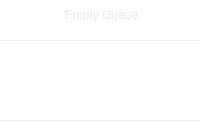
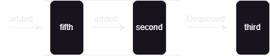
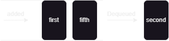
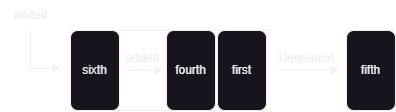

# Level-Order Traversal (BFS) Binary Trees

---

## What is Level-Order Traversal?

Level-Order Traversal is also known as **BFS** (Breadth First Search) and it is a technique that visits the nodes of the `Binary Tree` in a Breadth-first manner. In other words, It visits the whole level, before proceeding into  the other.

> Use case: BFS or Level-Order Traversal is useful when you need to process the nodes level by level. It can be used in finding shortest paths, creating a mirror of the tree and solving problems like zigzag traversal.

---

## How Does Level-Order Traversal Work?

This technique uses a particular data structure called a `queue` to keep track of the nodes to traverse level by level. We'll be simultaneously pushing and removing `nodes` off the queue as we visit in a breadth-first manner. Here are the steps: 

1. Start from the `root` of the Binary Tree. (Add the `root` to the queue)
2. Dequeue `root` to mark it as visited and add its left and right `nodes` to the queue. 
3. This process repeats for the other roots, until the whole binary tree has been fully visited.

---

#### Example :

```
       3
      / \
     2   5
    /   / \
   1   4   6
```

If we were to use the Level Order Traversal upon the binary tree above, the nodes will be visited in the following pattern :

- Start by adding `3` to the queue as it is the root of the tree.
- Dequeue `3` and mark it as visited. Continuously, we'll add `2` and `5` to the queue.
- Dequeue `2` to mark it as visited, add `1` to the queue since its the left node of `2`. 
- Dequeue `5` to mark it as visited, add `4` and `6` to the queue since they are the left and right nodes of `5`.
- Dequeue `1` to mark it as visited.
- Dequeue `4` and `6` after one another and mark as visited.
- The nodes will be visited in this order : `3 -> 2 -> 5 -> 1 -> 4 -> 6` 

> Note : Make sure you keep track of the queue when the process is running to visualize it properly

---

## Code Preview

```Java
public static void traverse(Tree root){
        Queue<Tree> queue = new LinkedList<>();
        queue.add(root);
        while(!queue.isEmpty()){
            Tree current = queue.remove();
            System.out.println(current.data);
            if(current.left != null){
            queue.add(current.left);
            }
            if(current.right != null){
            queue.add(current.right);
            }
        }
    }
```

**Initialize The Tree Nodes** :

```Java
        Tree third = new Tree(3);  // Root node
        Tree second = new Tree(2); // Left child of 3
        Tree fifth = new Tree(5);  // Right child of 3
        Tree first = new Tree(1);  // Left child of 2
        Tree fourth = new Tree(4); // Left child of 5
        Tree sixth = new Tree(6);  // Right child of 5

        // Connect the nodes to form the binary tree
        third.left = second;       // 2 is the left child of 3
        third.right = fifth;       // 5 is the right child of 3
        second.left = first;       // 1 is the left child of 2
        fifth.left = fourth;       // 4 is the left child of 5
        fifth.right = sixth;       // 6 is the right child of 5
```

---

## Step-By-Step Process

Initially, our queue would look like this:



Next, we'll add `root` into the queue.


Moving on, we'll enter the `while` loop which will go on until the queue is empty. Firstly, we'll dequeue whatever is in front; in our case is `third`. Then, we'll add its left and right nodes into our queue. Namely, `second` and `fifth`. [^1]

> Visited Nodes : `3`



We'll dequeue `second` since it is in the front. It will be marked as visited or printed out and its `left` and `right` nodes will be added into the queue. Since, `second` only has the `left` node, only that will be added into the queue. Namely, `first`.

> Visited Nodes : `3` , `2`



`fifth` will be dequeued and marked as visited. Its `left` and `right` nodes will be added into the queue. Namely `fourth` and `sixth`.

> Visited Nodes : `3` , `2` , `5` 



`first` will be dequeued and marked as visited. Since it doesn't possess any `left` or `right` node, we won't be adding new nodes into our queue.

> Visited Nodes : `3` , `2` , `5` , `1`


`fourth` will be dequeued and marked as visited. Since it doesn't possess any `left` or `right` node, we won't be adding new nodes into our queue.

> Visited Nodes : `3` , `2` , `5` , `1` , `4`


`sixth` will be dequeued and marked as visited. Since it doesn't possess any `left` or `right` node, we won't be adding new nodes into our queue.


> Visited Nodes : `3` , `2` , `5` , `1` , `4` , `6`

By looking at our queue, we can definitely say that our process has finished.


[^1]: Note : We'll be adding the `left` node of the dequeued node first, then the `right` node follows the `left` into the queue.