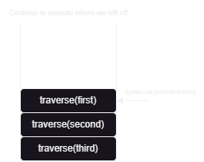
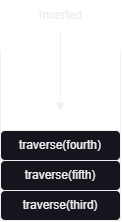
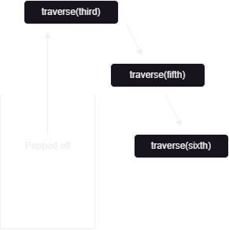

# In-Order Traversal (Binary Tree)
---

## What is In-Order Traversal?
In-Order traversal one of the 3 types of **DFS** (Depth first search) strategies. During in-order traversal technique, the nodes of the tree will be visited in the following sequence:

1. Left subtree
2. Root of the tree
3. Right subtree

>This traversal ensures that the nodes are visited in non-decreasing order for binary search trees (BSTs).

---

### How In-Order Traversal works?

To understand in-order traversal better, we'll look some examples: 
```
       3
      / \
     2   5
    /   / \
   1   4   6
```

By definition, the in-order traversal of this tree would follow this path:
1. Visit the left subtree of the root node (3) → Traverse the left subtree.
2. After traversing the left subtree, visit the root node (3).
3. Then, traverse the right subtree of the root node (3).

The in-order traversal of this tree will visit nodes in this order: `1 -> 2 -> 3 -> 4 -> 5 -> 6`.

---
### Steps For In-Order Traversal

When a given `Tree` with the root `root` got passed into `traverse(Tree root)`, the method follows these steps:

- Recursively traverse the left subtree.
- Process the root node (visit or print `root.data`).
- Recursively traverse the right subtree (call `traverse(root.right)`).

---

## Code Preview

**The traversal method** : 

```Java
 public static void traverse(Tree root){
        if(root == null) return;
        traverse(root.left);
        System.out.println(root.data);
        traverse(root.right);
    }
```

**Initializing the tree nodes** : 

``` Java
        Tree third = new Tree(3);  // Root node
        Tree second = new Tree(2); // Left child of 3
        Tree fifth = new Tree(5);  // Right child of 3
        Tree first = new Tree(1);  // Left child of 2
        Tree fourth = new Tree(4); // Left child of 5
        Tree sixth = new Tree(6);  // Right child of 5

        // Connect the nodes to form the binary tree
        third.left = second;       // 2 is the left child of 3
        third.right = fifth;       // 5 is the right child of 3

        second.left = first;       // 1 is the left child of 2

        fifth.left = fourth;       // 4 is the left child of 5
        fifth.right = sixth;       // 6 is the right child of 5


```

---

## Step-By-Step Process

> Note: It is recommended to use dark mode while reading this due to the diagrams. Light mode may reduce clarity in some visual representations.

Initially, the call stack would look like this.

 

Now we'll call the `traverse(Tree root)` method on our root node which is `third`. Then, the call `traverse(third)` will be added to the call stack.


The code moves onto `traverse(root.left)`. Since the left of the current `root` is `second` the following will be added to the call stack: `traverse(second)`.


The call stack only executes the top of the stack first, so `traverse(second)` gets executed. As usual, it'll call the left tree node of `second` which is `first`. The following call gets added to the call stack: `traverse(first)`.


The top of the call stack proceeds to call `traverse(null)` since, the tree node `first` don't have a left node. Therefore, a dead end occurs.


The base case `if(root == null) return;` handles the dead end by popping it off the stack.


Now, with `traverse(first)` on the top of the stack, we'll continue to execute from where we left off. Since, the we've executed `traverse(first.left)`, we proceed to `System.out.println(first.data)` to print out the value. In this case, we are only printing the value to show the process of In-Order traversal, but you can modify this part to do anything you want with the data.



Then, we proceed to execute the last piece of code which is `traverse(first.right)`. Since, the tree node doesn't have a `right` node. It's going to be `null`. Therefore, it will be popped off the stack. After that, we're back at `traverse(first)`. Since its processes are all completed, it also gets popped off. 

Now with `traverse(second)` on the top, we'll proceed to execute the code we left off : `System.out.println(second.data)`. Then, we proceed to adding `traverse(second.right)` to the stack. Since, second doesn't have a right node, it gets popped off. `traverse(second)` gets popped off afterwards as well.


We've finally reached the `root` of the tree which is `third`. We  shall proceed to execute `System.out.println(third.data)`. And add the traverse call on the right node of the root to the stack. `traverse(third.right)`.


The `traverse(fifth)` gets executed due to it being the top of the stack. It adds the call to it's left tree node onto the stack.`traverse(fourth)`.



`traverse(fourth)` will try to call `traverse()` on its left node but since it doesn't possess one, it gets popped of. Then `traverse(fourth)` proceed to print out its value. After that, it'll try to call `traverse()` on its right node but it also gets popped off due to it being `null`. `traverse(fourth)` also gets popped off after the execution completes.


`traverse(fifth)` continues its execution process by printing out its value and proceeding to add the call `traverse(fifth.right)` to the call stack.


`traverse(sixth)` gets executed since its on the top of the stack. It proceeds to call `traverse()` on its left node. Since its `null` it gets popped off. Then, `traverse(sixth)` proceeds to print its value. Moving on, it will proceed to call `traverse()` on its right node. Since its `null` it gets popped off. `traverse(sixth)` also gets popped off after its completion. `traverse(fifth)` and `traverse(thrid)` also gets popped off since their execution is done.



---
### Final Call Stack Visualization Summary:
- At each node, we first push a recursive call to traverse the left subtree.
- After the left subtree traversal completes, we print the node’s value.
- Finally, we push a recursive call to traverse the right subtree.
- As recursion unwinds, nodes are processed in the order `left -> root -> right`.

---

## Another Example Of In-Order Traversal On A Bigger Tree
Now, try to use the process above to manually traverse the given tree below: 


---