# Post-Order Traversal (Binary Tree)
---

## What is Post-Order Traversal?
Post-Order traversal is one of the 3 types of **DFS** (Depth first search) strategies. During post-order traversal technique, the nodes of the tree will be visited in the following sequence:

1. Left sub tree
2. Right sub tree
3. Root

---

### How Post-Order Traversal works?

To understand post-order traversal better, we'll look some examples: 
```
       3
      / \
     2   5
    /   / \
   1   4   6
```

By definition, the post-order traversal of this tree would follow this path:
1. Visit the left subtree of the root node (3) → Traverse the left subtree.
2. After traversing the left subtree, traverse the right subtree of the root node (3).
3. Then, traverse back to the root (3).

The post-order traversal of this tree will visit nodes in this order: `1 -> 2 -> 4 -> 6 -> 5 -> 3`.

---
### Steps For Post-Order Traversal

When a given `Tree` with the root `root` got passed into `traverse(Tree root)`, the method follows these steps:

- Recursively traverse the left subtree.
- Process the root node (visit or print `root.data`).
- Recursively traverse the right subtree (call `traverse(root.right)`).

---

## Code Preview

**The traversal method** : 

```Java
public static void traverse(Tree root){
        if(root == null) return;
        traverse(root.left);
        traverse(root.right);
        System.out.println(root.data);
        
    }
```

**Initializing the tree nodes** : 

``` Java
        Tree third = new Tree(3);  // Root node
        Tree second = new Tree(2); // Left child of 3
        Tree fifth = new Tree(5);  // Right child of 3
        Tree first = new Tree(1);  // Left child of 2
        Tree fourth = new Tree(4); // Left child of 5
        Tree sixth = new Tree(6);  // Right child of 5

        // Connect the nodes to form the binary tree
        third.left = second;       // 2 is the left child of 3
        third.right = fifth;       // 5 is the right child of 3
        second.left = first;       // 1 is the left child of 2
        fifth.left = fourth;       // 4 is the left child of 5
        fifth.right = sixth;       // 6 is the right child of 5


```

---

## Step-By-Step Process

> Note: It is recommended to use dark mode while reading this due to the diagrams. Light mode may reduce clarity in some visual representations.

Initially, the call stack would look like this.

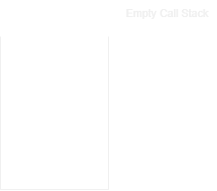 

Now we'll call the `traverse(Tree root)` method on our root node which is `third`. Then, the call `traverse(third)` will be added to the call stack.

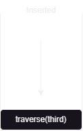

The code moves onto `traverse(root.left)`. Since the left of the current `root` is `second` the following will be added to the call stack: `traverse(second)`.

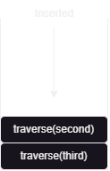

The call stack only executes the top of the stack first, so `traverse(second)` gets executed. As usual, it'll call the left tree node of `second` which is `first`. The following call gets added to the call stack: `traverse(first)`.

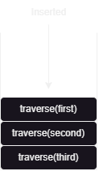

The top of the call stack proceeds to call `traverse(null)` since, the tree node `first` don't have a left node. Therefore, a dead end occurs.

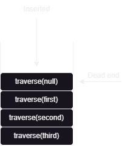

The base case `if(root == null) return;` handles the dead end by popping it off the stack.

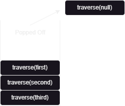

Now, with `traverse(first)` on the top of the stack, we'll continue to execute from where we left off. Since, the we've executed `traverse(first.left)`, we proceed to `traverse(first.right)` to traverse to the right subtrees. In this case, the tree node `first` do not possess a `right` node. Consequently, this will result in a similar senario to the previous step.

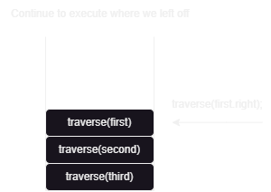

After popping the `traverse(null)` off the stack, we are back at `traverse(first)`. Then, we proceed to execute the last piece of code which is `System.out.println(first.data);`. This will print the value of `first` which is `1` in our case. Since `traverse(first)` is complete, we will pop it off the stack.

> Visited nodes : `1` 

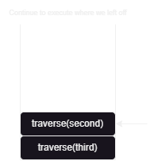

Now with `traverse(second)` on the top, we'll proceed to execute the code we left off : `traverse(second.right)`. Since, `second` doesn't have a right node, it gets popped off. Afterwards, we'll print out the value of `second`. Since the `traverse(second)` is complete, we will pop it off the stack.

> Visited nodes : `1` , `2` 


We've reached the `root` of the tree which is `third`. We  shall proceed to execute `traverse(third.right)` (To traverse towards its right subtrees). It will add `traverse(fifth)` to the stack.

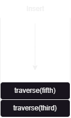

The `traverse(fifth)` gets executed due to it being the top of the stack. It adds the call to it's left tree node onto the stack.`traverse(fourth)`.

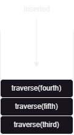

`traverse(fourth)` will try to call `traverse()` on its left node but since it doesn't possess one, it gets popped of. Then `traverse(fourth)` proceed to travel towards its right subtrees. It'll try to call `traverse()` on its right node but it also gets popped off due to it being `null`. Lastly, it'll print its value which is `4`. Afterwards, `traverse(fourth)` gets popped off from the stack since it is completed.

> Visited nodes : `1` , `2` , `4`

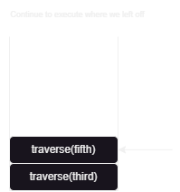

`traverse(fifth)` continues its execution process by proceeding to add the call `traverse(fifth.right)` to the call stack. AKA `traverse(sixth)`.

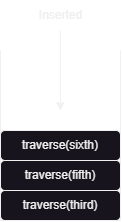

`traverse(sixth)` gets executed since its on the top of the stack. It proceeds to call `traverse()` on its left node. Since its `null` it gets popped off. Then, `traverse(sixth)` proceeds to call `traverse()` on its right node. Since its `null` it gets popped off. Lastly, it'll print its value and mark it as a `visited` node. `traverse(sixth)` gets popped off after its completion.

>Visited nodes : `1` , `2` , `4` , `6`


Since `traverse(fifth)` is at the top of the stack. We'll proceed to execute its last line of code, which is to print out its value. Namely, `5`. Then, this call gets popped off due to its completion.

>Visited nodes : `1` , `2` , `4` , `6` , `5`


After traversing the right subtrees, we'll be back at the `root` for the last time. By definition, post-order traversal will print out the `root` value in the end. We'll print the value of `third` node and pop it off the call stack, ending the whole traverse process.

---
### Final Call Stack Visualization Summary:
- At each node, we first push a recursive call to traverse the left subtrees.
- After the left subtree traversal completes, we will traverse the right subtrees recursively.
- Finally, we will print the values of the tree nodes which are on the top of the stack.
- As recursion unwinds, nodes are processed in the order `left -> right -> root`.

---

## Another Example Of Post-Order Traversal On A Bigger Tree
Now, try to use the process above to manually traverse the given tree below: 

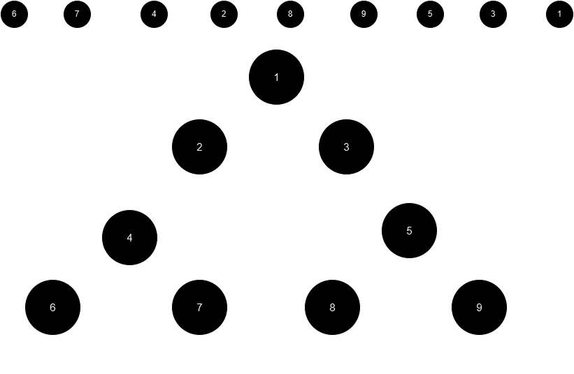

---