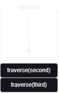
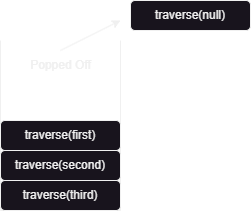

# Pre-Order Traversal (Binary Trees)
---

## What is Pre-Order Traversal?

Pre-Order traversal is one of the 3 types of **DFS** (Depth first search) strategies. During pre-order traversal technique, the nodes of the tree will be visited in the following sequence:

1. the **root** of the tree
2. the **left** subtrees
3. the **right** subtrees

> Useful to get prefix expressions from the expression tree. Additionally, can be used in cases when the root has to be visited first.

---

### How Pre-Order Traversal works?

To understand pre-order traversal better, we'll look into some examples:
```
       3
      / \
     2   5
    /   / \
   1   4   6
```
By definition, the pre-order traversal of the following tree will follow this particular pattern:

1. Visit the root node which is `3`. Then, traverse towards the left subtrees.
2. Will reach the end of the left subtree which is `1`. Then, traverse towards the right subtrees.
3. finally comes to the end after the right subtrees are fully visited.

Pre-Order traversal of this tree will visit nodes in this order: `3 -> 2 -> 1 -> 5 -> 4 -> 6`.

---
### Steps For Post-Order Traversal

When a given `Tree` with the root `root` got passed into `traverse(Tree root)`, the method follows these steps:

- Process the root node (visit or print `root.data`).
- Recursively traverse the left subtree (call `traverse(root.left)`).
- Recursively traverse the right subtree (call `traverse(root.right)`).

---

## Code Preview

**The traversal method** : 

```Java
public static void traverse(Tree root){
        if(root == null) return;
        System.out.println(root.data);
        traverse(root.left);
        traverse(root.right);
    }
```

**The tree initialization** :

```Java
        Tree root = new Tree(3);  // Root node
        Tree node2 = new Tree(2);
        Tree node5 = new Tree(5);
        Tree node1 = new Tree(1);
        Tree node4 = new Tree(4);
        Tree node6 = new Tree(6);

        // Build the structure
        root.left = node2;
        root.right = node5;
        node2.left = node1;
        node5.left = node4;
        node5.right = node6;
        traverse(root);
```
---

## Step-By-Step Process

> Note: It is recommended to use dark mode while reading this due to the diagrams. Light mode may reduce clarity in some visual representations.

Initially, the call stack would look like this.

 

Now we'll call the `traverse(Tree root)` method on our root node which is `third`. Then, the call `traverse(third)` will be added to the call stack.


Since Pre-Order traversal visits the root first, we'll print the value of the `root` which is `3`. Then we'll proceed to call `traverse(third.left)` to traverse the left subtrees. Therefore, `traverse(second)` will be added to the call stack.

> Visited nodes : `3`



The call stack only executes the top of the stack first, so `traverse(second)` gets executed. As usual, we'll print the value of the node which is `2`. Then, we'll call `traverse(second.left)`, traversing further into the left subtree. Therefore, `traverse(first)` will be added to the call stack.

> Visited nodes : `3` , `2`


The top of the call stack proceeds to print out the value of the node which is `1`. Afterwards, it'll proceed to call `traverse(first.left)`. Since, the tree node `first` don't have a left node, a dead end occurs.

> Visited nodes : `3` , `2` , `1`


The base case `if(root == null) return;` handles the dead end by popping it off the stack.



Now, with `traverse(first)` on the top of the stack, we'll continue to execute from where we left off. Since we've executed `traverse(first.left)`, we proceed to `traverse(first.right)` to traverse to the right subtrees. In this case, the tree node `first` do not possess a `right` node. Consequently, this will result in a similar senario to the previous step.


After popping the `traverse(null)` off the stack, we are back at `traverse(first)`. Since traversing the right subtrees was its last line of code, `traverse(first)` is complete, we will pop it off the stack.


Now with `traverse(second)` on the top, we'll proceed to execute the code we left off : `traverse(second.right)`. Since, `second` doesn't have a right node, it gets popped off. Afterwards, we will pop it off the stack, since all its code has been executed.

We've reached the `root` of the tree which is `third`. We  shall proceed to execute `traverse(third.right)` (To traverse towards its right subtrees). It will add `traverse(fifth)` to the stack. Since `traverse(third)` had completed its execution, it gets popped off the stack.


The `traverse(fifth)` gets executed due to it being the top of the stack. It will mark the `fifth` node as visited and print out its value. Then, it adds the call to it's left tree node onto the stack.`traverse(fourth)`.

> Visited nodes : `3` , `2` , `1` , `5`


`traverse(fourth)` prints out its value and will try to call `traverse()` on its left node but since it doesn't possess one, it gets popped of. Then `traverse(fourth)` proceed to travel towards its right subtrees. It'll try to call `traverse()` on its right node but it also gets popped off due to it being `null`. Afterwards, `traverse(fourth)` gets popped off from the stack since it is completed.

> Visited nodes : `3` , `2` , `1` , `5` , `4`


`traverse(fifth)` continues its last execution process by proceeding to add the call `traverse(fifth.right)` to the call stack. `traverse(sixth)` is added to the call stack. `traverse(fifth)` is popped off the stack.


`traverse(sixth)` gets executed since its on the top of the stack. `traverse(sixth)` proceeds to mark itself visited by printing out its value. Then, it will call `traverse()` on its left node. Since its `null` it gets popped off. Then, `traverse(sixth)` proceeds to call `traverse()` on its right node. Since its `null` it gets popped off. `traverse(sixth)` gets popped off after its completion.

> Visited nodes : `3` , `2` , `1` , `5` , `4` , `6`


Now, we can say that our traversal process is fully complete.

---
### Final Call Stack Visualization Summary:
- At each node, we first print out the value and then traverse towards the left subtrees.
- After the left subtree traversal completes, we will traverse the right subtrees recursively.
- As recursion unwinds, nodes are processed in the order `root -> left -> right`.

---

## Another Example Of Pre-Order Traversal On A Bigger Tree
Now, try to use the process above to manually traverse the given tree below: 


---