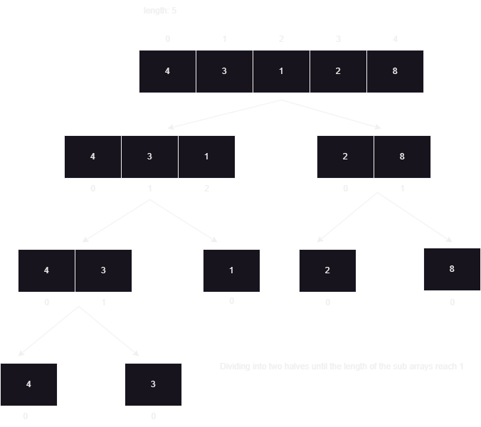
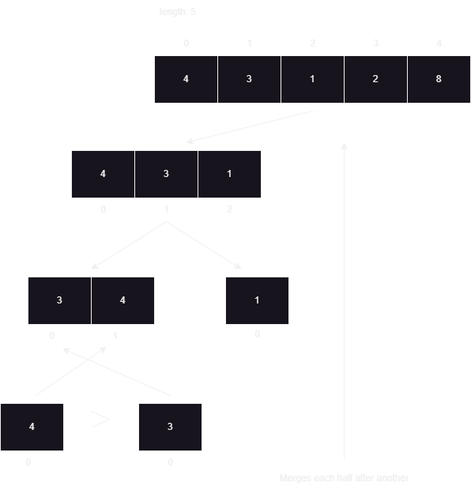
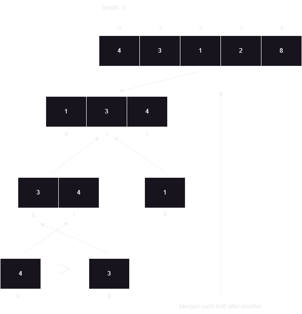
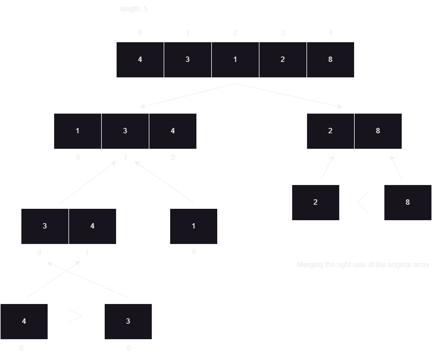
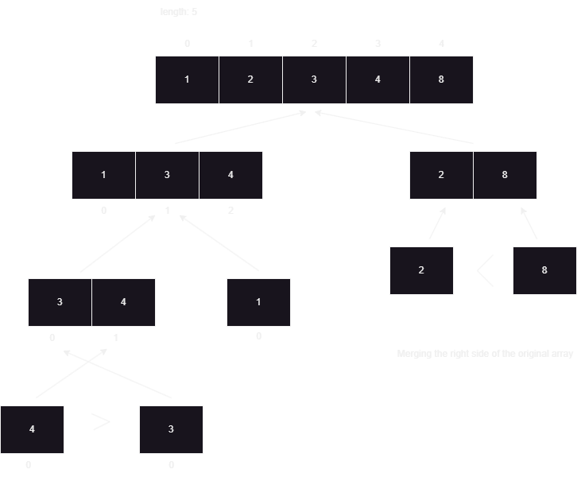

# Merge Sort
---

## What Is Merge Sort?

Merge sort is a sorting algorithm that uses the "Divide And Conquer" technique. It will recursively divide the array into two sub arrays until the length of the sub arrays becomes `1`. A helper function called `merge()` will perform various operations to sort the divided sub arrays.

> In a nutshell, merge sort will divide the array into two halves, sort each half and then merge the two sorted arrays together.

---

## How Does Merge Sort Work?

To be able to know clearly on how Merge Sort works, we shall look at the `Divide` , `Conquer` and `Merge` steps.

1. **Divide** : We will divide the array into two halves until there is none to divide.
2. **Conquer** : We will sort each sub arrays individually (`left` and `right`).
3. **Merge** : The sorted sub arrays will be merged until all elements from both sides of the array is merged and sorted.

---

## Code Preview

**The Main Method**

```Java
 public static void mergeSort(int[] arr){
        if(arr.length <= 1) return;
        int left = 0;
        int right = arr.length - 1;
        int mid = (left + right) / 2;
        int i = 0;
        int j = 0;
        int[] leftSubArr = new int[mid + 1];
        int[] rightSubArr = new int[arr.length - leftSubArr.length];

        for(; i < arr.length; i++){
            if( i <= mid){
                leftSubArr[i] = arr[i];
            } else {
                rightSubArr[j] = arr[i];
                j++;
            }
        }
        
        //Recursive calls to left and right sub arrays.
        mergeSort(leftSubArr);
        mergeSort(rightSubArr);
        merge(leftSubArr, rightSubArr, arr);
    }
```

**Utility Method**

```Java
 private static void merge(int[] leftArr, int[] rightArr, int[] arr ){
        int leftLength = leftArr.length;
        int rightLength = rightArr.length;
        int i = 0;
        int j = 0;
        int z = 0;
        while(i < leftLength && j < rightLength){
            if(leftArr[i] > rightArr[j]){
                arr[z] = rightArr[j];
                j++;
            } else {
                arr[z] = leftArr[i];
                i++;
            }
            z++;
        }
        while(i < leftLength){
            arr[z] = leftArr[i];
            i++;
            z++;
        }
        while(j < rightLength){
            arr[z] = rightArr[j];
            j++;
            z++;
        
        }
        
    }
```
---

## Step-By-Step Process

We'll be looking at an example to really clarify how merge sort works. 
Consider the array : `[4 , 3 , 2 , 1 , 8]` 

**Dividing the array into two sub arrays**

>Base Case: Dividing process will stop once the length of the sub arrays reach 1

In order to divide into two sub arrays, we would need to know the middle index of the array. We will determine the middle index by `(left + right) / 2`. The left index of the array will be `0` and the right can be obtained by `array.length - 1`. Next, we'll initialize the indices (`i` and `j`) that will be used when copying elements from our (**Array To Be Divided**) to `left` and `right` sub arrays. 

Next, we instantiate two arrays `leftSubArr` and `rightSubArr` that will be used when copying elements. `leftSubArr`'s length will be from the start of the array to the middle index (includes the middle index). `rightSubArr`'s length will be the remaining (`array.length - leftSubArr.length`).

A for-loop will be used in the copying process. 

```Java
 for(; i < arr.length; i++){
            if( i <= mid){
                leftSubArr[i] = arr[i]; //Filling up the left sub array
            } else {
                rightSubArr[j] = arr[i]; //Filling up the right sub array once i is over the middle index
                j++;
            }
        }
```
Once the array has been divided into two halves, each half will be passed into the recursive calls to `mergeSort(...)` (i.e. to further divide the sub arrays into two halves). Lastly, we will call the `merge(...)` (The helper method) by passing in the required arguments. `merge(...)` will deal with the sorting and merging responsibilities. 

Here's the diagramatic respresentation of the above process: 

 

**Sorting and Merging using merge(...)**

In the sorting and merging process, each half or branch of the **Original Array** will be processed after another. Firstly, it will try to sort and merge the left side of the **Original Array**. By looking at our diagram, our latest divided sub arrays are `[4]` and `[3]`. If we were to compare them `3 < 4` so `3` will be inserted into the parent sub array `[4 , 3]` making it `[3 , 3]`. And lastly we'll insert `4` into the remaining index, making the parent sub array `[3,4]` (Now a sub array is sorted).



Next we will have `[3 , 4]` as the left sub array and `[1]` as the right sub array. `[4 , 3 , 1]` will be the parent array that will be the combination of left and righ sub arrays (sorted). 

```Java
        int leftLength = leftArr.length;
        int rightLength = rightArr.length;
        int i = 0;
        int j = 0;
        int z = 0;
```
In the helper method, we initialized the variables we would be needing when iterating `leftArr` , `rightArr` and `arr` while comparing `leftArr[i]` and `rightArr[j]` to sort and merge them together.

```Java
while(i < leftLength && j < rightLength){
        if(leftArr[i] > rightArr[j]){
            arr[z] = rightArr[j];
            j++;
        } else {
            arr[z] = leftArr[i];
            i++;
        }
         z++;
}
```

This piece of code will iterate left and right sub arrays to check whoever is greater. Initially, we would have `i = 0` , `j = 0` , `z = 0`. In our case, `leftArr[0]` which is `3` is greater than `rightArr[0]` which is `1`. Consequently, the element in the right array gets its place in the parent sub array, making it `[1 , 3 , 1]`. Lastly `j` gets incremented to compare with the remaining elements in right sub array. However, in our case, we had reached the end of our right sub array. Therefore, the loop will come to an end. As you can see, the merging process of the two sub arrays isn't done yet.

```Java
        //To add the remaining elements if left array has some elements left
        while(i < leftLength){
            arr[z] = leftArr[i];
            i++;
            z++;
        }

        //To add the remaining elements if right array has some elements left
        while(j < rightLength){
            arr[z] = rightArr[j];
            j++;
            z++;
        
        }
```

Since our left sub array has already been sorted we can safetly insert its remaining elements into our parent sub array, making it `[1, 3, 4]`.



Since our left side of the **Original Array** has been sorted and merged successfully, we will move onto the right side. On the right side we have `[2]` and `[8]` as our latest divided sub arrays. Since `8 > 2`, `2` gets a place in the parent array making it `[2 , 8]`. Lastly, `8` is inserted. So our result from this step would be `[2 , 8]`.



Finally, we will be merging and sorting `[1 , 3 , 4]` (The left sub array) and `[2 , 8]` (The right sub array). Therefore, forming the sorted version of the original array. For the iteration, `i , j , z` will start from zero index. `leftArr[0]` ( `1` ) is less than `rightArr[0]` ( `2` ). So `1` will be inserted into `arr[0]`.

> Original Array : `[1 , 3 , 1 , 2 , 8]`

After the insertion, we will increment `z` and `i`. `leftArr[1]` ( `3` ) is greater than `rightArr[0]` ( `2` ). Therefore, `2` will be inserted into `array[1]`.

> Original Array : `[1 , 2 , 1 , 2 , 8]`

Once the insertion is done, we will be incrementing `z` and `j`. `leftArr[1]` ( `3` ) is less than `rightArr[2]` ( `8` ). As a result, `3` will get its place which is `array[2].

> Original Array : `[1 , 2 , 3 , 2 , 8]`

Moving on, we will increment `z` and `i`. `leftArr[2]` ( `4` ) is less than `rightArr[2]` ( `8` ). `4` will be added into `arr[3]`.

> Original Array : `[1 , 2 , 3 , 4 , 8]`

After incrementing `z` and `i` we will reach the end of the left sub array. Therefore, ending the loop. With the help of the while-loop, we can add the remaining element `8` from the right sub array onto the original array. The merge sort is now complete.

> Original Array : `[1 , 2 , 3 , 4 , 8]`



---

## Time Complexity 

| Cases        | Time Complexity |
| ---          | ---             |
| Best Case    |  O(n log n)     |
| Average Case |  O(n log n)     | 
| Worst Case   |  O(n log n)     |

---

> Athough merge sort has constant time complexity for all cases, the space complexity of the algorithm is O(n). Quick sort has the time complexity of O(n log n), but in the worst case scenario it becomes O(n^2^). Unlike Merge Sort, Quick Sort has space complexity of O(1). So we should consider which algorithm should be used depending on our circumstances.