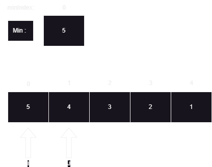
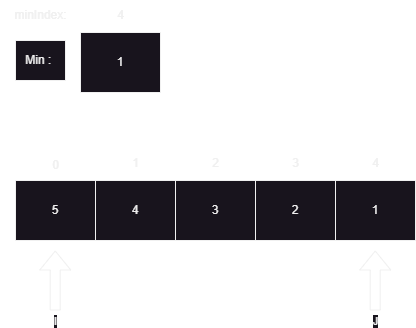
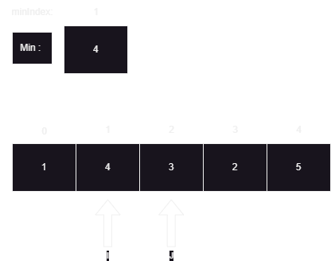
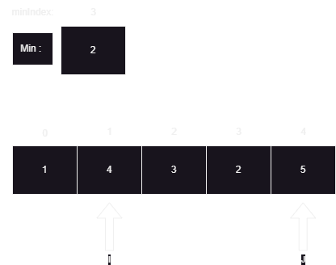
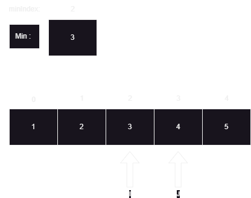
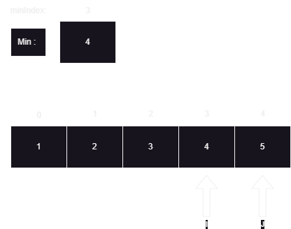

# Selection Sort 

---

## What Is Selection Sort?

Selection sort is one of the simplest and inefficient sorting algorithms. Although it is very simple and easy to implement, its inefficiency makes it almost unusable when dealing with large data sets. 

> Selection Sort is a simple and intuitive sorting algorithm that works by repeatedly selecting the smallest (or largest, depending on the order) element from an unsorted portion of the array and moving it to the beginning.

---
## How Does Selection Sort Work?

We will need some variables to aid us in the process: A variable that will store the current smallest element, A variable that will act as an index for the outer loop, A variable that will act as an index for the inner loop and lastly a temporary variable which will help during the swapping process.

1. Initialization : The Algorithm starts by initializing the smallest element was the first element in a list.
2. Selection : As the outer loop traverses, we'll use an inner loop to search for the smallest element within our list (by comparing each element in the inner loop to the current smallest element.)
3. Swap : After the smallest element has been obtained by the end of the inner loop, we'll compare it against our first unsorted element. If our first unsorted element is greater, we'll perform a swap.
4. Repeat : The above processes will repeat until the whole list is sorted.

---

## Code Preview

The following is the implementation of selection:

``` java
static void sort(int[] arr){
       for (int i = 0; i < arr.length; i++) { // Outer loop that runs until the end of the list
           int min = arr[i]; // we'll initialize our variable to store the current smallest element
           int minIndex = i; // we'll also store its index which will be used in swapping
           for( int j = i + 1; j < arr.length; j++){  // The inner loop that starts exactly after our index i.
                    if(arr[j] < min){  // Condition check to search for the smallest element
                        min = arr[j];  
                        minIndex = j;
                    }
           }
           if(arr[i] > min){ // Condition check to see if we need to perform a swap
            int temp = arr[i];
            arr[i] = min;
            arr[minIndex] = temp;
           } 
       }
    }
```
---

## Step-By-Step process

As an example, lets sort this array : `[5 , 4 , 3 , 2 , 1]`.

The outer loop starts with the index `i = 0`.

We'll start by initializing the `min` variable as the first unsorted element. So `min` will be `5` and its index would be `0` (`minIndex = 0`). Then, the inner loop starts exactly from the index after `i` (Making `j = i + 1`). 




In the inner loop we'll iterate until the end of the list while seeking for the smallest element. With each iteration we'll compare our current element to our current `min` element. If our current element is less than our current `min` element, we'll update our `min` and `minIndex`.

By the end of the inner loop we'd have the value `1` for our `min` variable and `4` for our `minIndex`.



Since the conditions to swap turns out to be true, we'll swap the values `1` and `5`. (Placing the smallest element in the front) After the swap we will increment `i`. And above processes repeat.



As shown in picture, we'll iterate using index `j` til the end to search for the smallest element. By the end of the inner loop we'll get the value `2` as the smallest element.



Since the conditions to swap turns out to be true, we'll swap the values `2` and `4`. Then we'll continue our outer loop by incrementing `i`. 



As inner loop reaches end we wont be able to find the element smaller than our current smallest element which is `3`. In this case, the condition to swap will not turn out to be true. So we'll continue our outer loop by incrementing `i`.



As we check for an element smaller than our current smallest value, we will surely fail since there's no element left which is smaller than `4`. Therefore, there will be no swap. And we'll obtain a sorted list. 

Result : `[1 , 2 , 3 , 4 , 5]`

---

## Time Complexity

In selection sort, the outer loop runs `n` times and the inner loop runs n-1, n-2, n-3 , ... , 2 , 1 times. When we sum all of those and use the Big O notation, we'll get O(n^2^), making selection sort inefficient when it comes to dealing with large datasets.

---

## Space Complexity

As we use a constant amount of variables without any dynamic datastructures, the space complexity of selection sort is O(1).


​
 
