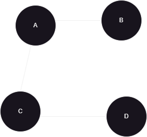
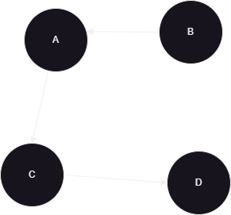
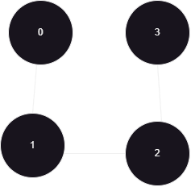

# The Graph Data Structure
---

## What Is A Graph?

A Graph is a non-linear data structure consisting of nodes (also known as vertices) and edges that connect pairs of nodes. It is used to model relationships between objects in various domains such as social networks, transportation systems, and computer networks.

> Fun fact: The application google maps uses the graph data structure in order to calculate shortest paths and provide navigation aid.

---

## Terminology

- **Vertex (Node)**: A fundamental unit that represents an entity in the graph.
- **Edge**: A connection between two vertices representing a relationship.
- **Degree**: The number of edges connected to a vertex.
- **Path**: A sequence of edges that connects a series of vertices.
- **Cycle**: A path in which the starting and ending vertices are the same.

---

## Types Of Graphs

Here are the two types of graphs :

- **Directed Graphs** : Directed Graph or Digraph contains edges with directions 
- **Undirected Graphs** : Undirected Graph contains edges without directions

The above picture is a representation of an undirected graph.

The above picture is a representation of a directed graph.

---

## Implementing graph in different ways

There are many ways to implement the graph data structure. Here, we will explore how to implement graph in three different ways. Namely, *Adjacency Map*, *Adjacency Matrix* and *Adjacency List*.

---

## Adjacency Matrix

Here is the representation of the above matrix as an undirected graph : 

---

## Adjacency List

Here is also the representation of the same graph but by using adjacency list method.

> Note : An adjacency list by itself doesn't inherently show incoming edges unless explicitly constructed to do so.