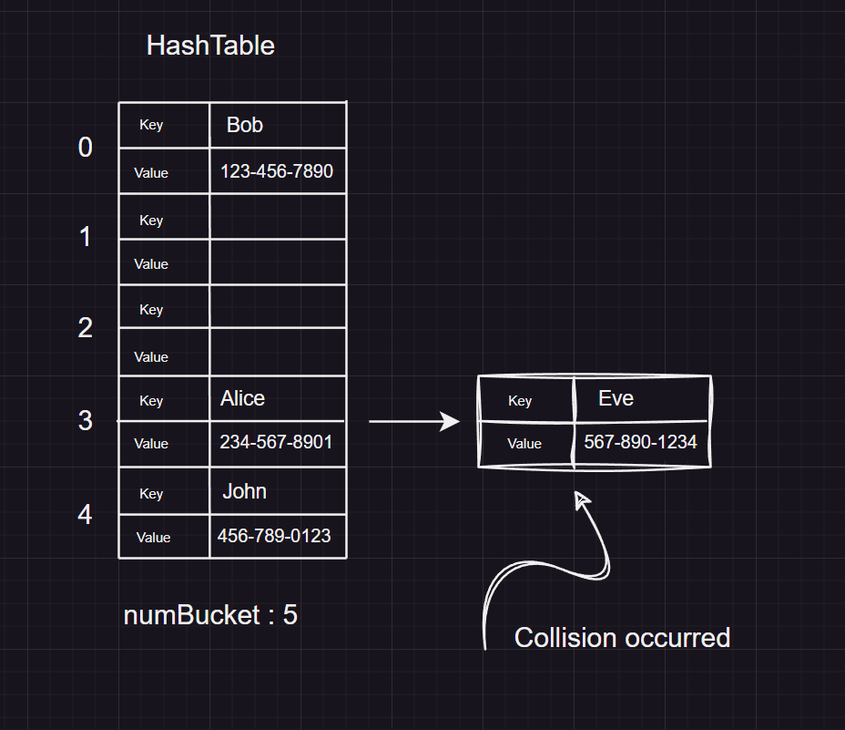

# Hash Tables
---

## What Is A Hash Table?

A hash table is a type of data structure where the index of an element within the table is determined using a `hash function`. This data structure is best known for its ability quickly and efficiently find and retrieve data within the hash table. Each entry in a hash table is stored in `key` and `value` pairs, where the index can be generated by using a `hash function` upon the `key` of the entry.

> In real-life we use hash tables to implement phone number lookups, social security databases, libraries, and in username-password retrievals.

---

## Implementing A Hash Table

To implement a hash table of our own we need the main class `HashTable` and an inner class called `HashNode`. [^1]

**The Inner Class :**

```Java
private class HashNode<K,V>{
    K key;
    V val;
    HashNode next;
    int hashCodeVal;
    HashNode(K key, V val, int hashCodeVal){
        this.key = key;
        this.val = val;
        this.hashCodeVal = hashCodeVal;
    }
   }
```

This is a typical linked list node that stores:

1. The `key` of the entry.
2. The `value` of the entry.
3. The `next` node of the entry. (Only when there's an index collision)
4. The `hashCodeValue` of the node.

**The Main Class :**

```Java

public class HashTable<K,V>{
   private class HashNode<K,V>{
    K key;
    V val;
    HashNode next;
    int hashCodeVal;
    HashNode(K key, V val, int hashCodeVal){
        this.key = key;
        this.val = val;
        this.hashCodeVal = hashCodeVal;
    }
   }
  private ArrayList<HashNode<K,V>> bucketArray;
  private int numBucket;
  private int size = 0;

    private int hash(K key){
        if(key instanceof Integer integer){
            return integer;
        } else {
            String keyStr = "" + key;
            int n = keyStr.length();
            int hashCode = 0;
            int power = 1;
            for (int i = n - 1 ; i <= 0; i--){
                hashCode += keyStr.charAt(i) * power;
                power *= 31; 
            }
            return hashCode;
        }
    }
    private int getBucketIndex(K key){
        int rawHashKey = hash(key);
        int hashKey = rawHashKey < 0 ? rawHashKey * -1 : rawHashKey;
        int index = hashKey % numBucket;
        return index;
    }
    public HashTable() {
        bucketArray = new ArrayList<>();
        numBucket = 10;
        for (int i = 0; i < numBucket; i++) {
            bucketArray.add(null); // Empty out all elements with null initially
        }
    }

    public void add(K key, V val){
        int bucketIndex = getBucketIndex(key);
        int hashCode = hash(key);
        HashNode<K,V> newNode = new HashNode<>(key, val, hashCode);
        HashNode<K,V> head = bucketArray.get(bucketIndex);
        HashNode<K,V> prev = null;
        while(head != null){
            if(head.key.equals(key) && head.hashCodeVal == hashCode ){
                head.val = val;
                return;
            }
            prev = head;
            head = head.next;
        }
        size++;
        if(prev != null){
            prev.next = newNode;
        } else {
            newNode.next = head;
            bucketArray.set(bucketIndex, newNode);
        }

        // This code will be executed when Load factor is exceeded (Load Factor = 0.7 or 70% of the hashtable)
        if(( 1.0 * size  / numBucket) >= 0.7){
            ArrayList<HashNode<K,V>> temp = bucketArray;
            numBucket = 2 * numBucket;
            bucketArray = new ArrayList<>(numBucket);
            size = 0;
            for (int i = 0; i < numBucket; i++) {
            bucketArray.add(null); // Empty out all elements with null initially
            }   

            for(HashNode<K,V> headNode : temp){
                while(headNode != null){
                add(headNode.key, headNode.val);
                headNode = headNode.next;
                }
            }
        }
    }

    public V remove(K key){
        int bucketIndex = getBucketIndex(key);
        int code = hash(key);
        HashNode<K,V> head = bucketArray.get(bucketIndex);
        HashNode<K,V> prev = null;
        while(head != null){
            if(head.key.equals(key) && head.hashCodeVal == code){
                if(prev != null){
                    prev.next = head.next;
                    size--;
                    return head.val;
                } else {
                    bucketArray.set(bucketIndex,head.next);
                    size--;
                    return head.val;
                }
            }
            prev = head;
            head = head.next;
        }
        return null;
    }

    public V get(K key){
        int bucketIndex = getBucketIndex(key);
        int code = hash(key);
        HashNode<K,V> head = bucketArray.get(bucketIndex);
        while(head != null){
            if(head.key.equals(key) && head.hashCodeVal == code){
                return head.val;
            }
            head = head.next;
        }
        return null;
    }
    
    public boolean isEmpty(){
        return size == 0;
    }

    public int getSize(){
        return size;
    }

   
   
}
```

In this implementation of our hash table, the main class does a number of processes including `insertion` , `deletion` and getting the value of a certain `key`. 

> There are some utility methods which are marked private which helps with certain processes such as generating hashCodes, getting indices of certain keys and so on.

---
## Attributes Of The Main Class

```Java
  private ArrayList<HashNode<K,V>> bucketArray;
  private int numBucket;
  private int size = 0;
  ```

- `bucketArray` will store the `key`, `value` paired entries we add. 
- `numBucket` will be the size allocated within the `bucketArray` (Initially 10). [^2]
- `size` will be the number of entries that we have added into the hash table so far.

---

## Insertion Method

1. `add(K key, V val)`

As the name suggests, we'll be adding a new entry using this method. The method accepts 2 arguments : 
- a key and 
- a value.

Once its arguments are passed, it generates a `bucketIndex` for the new entry by using the `key` provided. Here is the utility method that is responsible: 

```Java
 private int getBucketIndex(K key){
        int rawHashKey = hash(key);
        int hashKey = rawHashKey < 0 ? rawHashKey * -1 : rawHashKey;
        int index = hashKey % numBucket;
        return index;
    }
```

Within this method, the `key` is used to generate a hash code using another utility method called `hash`. Once the hash code is obtained, it makes sure that the `rawHashKey` is a positive integer. Then we compute the `bucketIndex` by using modulo operator. `hashKey % numBucket`. Lastly, we'll return the index.

Here's the hash method:

```Java
    private int hash(K key){
        if(key instanceof Integer integer){
            return integer;
        } else {
            String keyStr = "" + key;
            int n = keyStr.length();
            int hashCode = 0;
            int power = 1;
            for (int i = n - 1 ; i <= 0; i--){
                hashCode += keyStr.charAt(i) * power;
                power *= 31; 
            }
            return hashCode;
        }
    }
```

The hash method will check if the provided key is an integer or not. If it is an integer, we will directly use the integer value as hash code. Next, we'll compute the hashCode using this formula:

 S[0] * 31^n-1^ + S[1] * 31^n-2^ + . . . + S[n-1] * 1 

Now, we're back at our `add(...)` method.
Once, a hash code and index is obtained, we'll check if the index is already occupied by another entry. If it is we'll use **Separate Chaining Collision Handling Technique** to place the new entry in the back of the linked list. 



Here is the example case where an index collision could occur. In a contact saving app, whenever we add an entry it will create an index by using the key. Which in this case is the name. After that, we'll determine the index by using the modulo operator. This process may produce an index more than once, therefore, causing a collision.

``` 
    Alice: 
    Hash Code: 63350368
    Index: 63350368 % 5 = 3

    Eve:
    Hash Code: 70068
    Index : 70068 % 5 = 3
```
To solve collisions, we can use various methods: 

**Open Addressing Methods**

1. Linear probing
2. Quadratic probing
3. Double hashing

**Closed Addressing Method**

1. Separate Chaining Technique (What we are using right now)

Here's the part where, we prepare to check if the index is collided or not.

```Java
        HashNode<K,V> newNode = new HashNode<>(key, val, hashCode); // Instantiating the new Hash Node
        HashNode<K,V> head = bucketArray.get(bucketIndex); // By getting the node at the index of the new node, we can check whether the index is taken or not
        HashNode<K,V> prev = null; // We'll keep count of the previous node to being the iteration.
```

This portion iterates the linked list if it exist and if the two hash codes of the keys are equal, we'll update that particular `HashNode`'s value. Otherwise, we will add the new entry in the back. If the bucket isn't occupied, it adds it into the `bucketIndex`.

```Java
while(head != null){
            if(head.key.equals(key) && head.hashCodeVal == hashCode ){
                head.val = val; //Updating the hashNode's value since the keys are equal
                return;
            }
            prev = head;
            head = head.next;
        }
        size++;
        if(prev != null){
            prev.next = newNode;
        } else {
            newNode.next = head;
            bucketArray.set(bucketIndex, newNode);
        }
```

While adding a new entry, we might encounter a certain event when the current size of the hash table is equal to or over the `load factor`, then we will double the allocated size of the hash table and rehash all the entries using the new `numBucket` value.

```Java
 // This code will be executed when Load factor is exceeded (Load Factor = 0.7 or 70% of the hashtable)
        if(( 1.0 * size  / numBucket) >= 0.7){
            ArrayList<HashNode<K,V>> temp = bucketArray;
            numBucket = 2 * numBucket;
            bucketArray = new ArrayList<>(numBucket);
            size = 0;
            for (int i = 0; i < numBucket; i++) {
            bucketArray.add(null); // Empty out all elements with null initially
        }   
            // Re hashing all the entries
            for(HashNode<K,V> headNode : temp){
                while(headNode != null){
                add(headNode.key, headNode.val);
                headNode = headNode.next;
        }
```

---

## Remove method

2. `remove(K key)`

To remove the entry with the provided `key`, we'll first get the hash code of the `key`. Then, we'll determine the index of the entry that we wish to delete using the modulo operator. Once the node in the exact bucket index is obtained, we'll get the hash code of the node in the bucket and compare them. If it is equal we'll delete the node by setting it as `null`. Otherwise, we'll traverse the linked list until we reach the desired node. Then we can remove the node using `prev`.

**Code Preview :**

```Java

     public V remove(K key){
        int bucketIndex = getBucketIndex(key);
        int code = hash(key);
        HashNode<K,V> head = bucketArray.get(bucketIndex);
        HashNode<K,V> prev = null;
        while(head != null){
            if(head.key.equals(key) && head.hashCodeVal == code){
                if(prev != null){
                    prev.next = head.next;
                    size--;
                    return head.val;
                } else {
                    bucketArray.set(bucketIndex,head.next);
                    size--;
                    return head.val;
                }
            }
            prev = head;
            head = head.next;
        }
        return null;
    }
```
---

## Get Method

3. `get(K key)`

As the name suggests, it'll find the entry with the provided key. First, we'll get the `bucketIndex` and `hashCode`. We'll get the head node at the `bucketIndex`, traverse it until the two hash codes of the keys are equal. Then return the `value`.

**Code Preview :**
```Java
 public V get(K key){
        int bucketIndex = getBucketIndex(key);
        int code = hash(key);
        HashNode<K,V> head = bucketArray.get(bucketIndex);
        while(head != null){
            if(head.key.equals(key) && head.hashCodeVal == code){
                return head.val;
            }
            head = head.next;
        }
        return null;
    }
```
---

## IsEmpty( )

This method will tell you whether the hash table is empty or not.

**Code Preview :**

```Java
 public boolean isEmpty(){
        return size == 0;
    }
```

---

## getSize( )

This method will return the current size of the hash table.

```Java
public int getSize(){
        return size;
    }
```
---

## Time Complexity 

|  Operation    |  Time Complexity     |  
|   ---         | ---                  | 
| Insertion     | O(1)                 | 
| Deletion      | O(1)                 |
| Search        | O(1)                 |

> Note: Although in the best case and average case, the operations will perform in constant time but if there are collisions and in worst case, it becomes O(n).

[^1]: The reason why we need the inner class `HashNode` is because we are using the "Separate Chaining Collision Handling Technique", which stores collided indices as a `LinkedList`.
[^2]: It will be used to calculate our load factor; if we exceed or reach our load factor which is 70% of the current size allocated, we'll double the size of our `bucketArray` and `reHash` all our stored entries using `numBucket`.